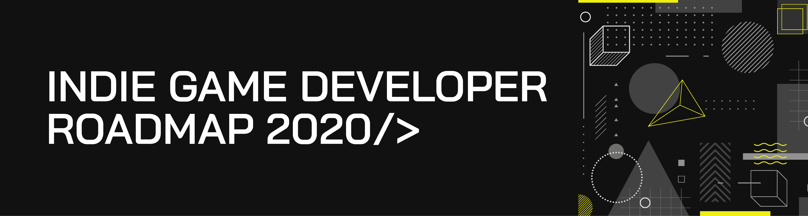
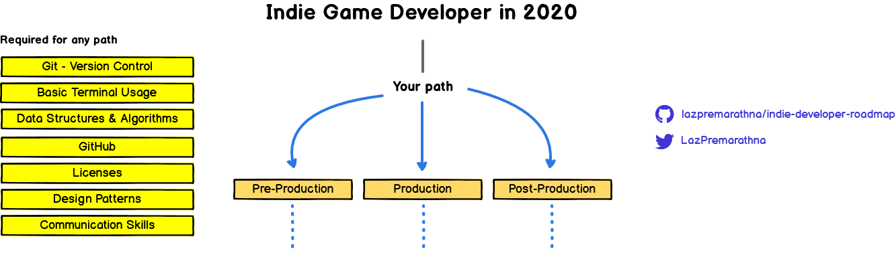

> Roadmap to becoming a indie game developer in 2020, inspired by [web-developer-roadmap](https://github.com/kamranahmedse/developer-roadmap).

Below you find a set of charts demonstrating the paths that you can take and the technologies that you would want to adopt in order to become a indie game developer.

***

### Purpose of these Roadmap

> The purpose of these roadmaps is to give you an idea about the landscape and to guide you if you are confused about what to learn next and not to encourage you to pick what is hip and trendy. You should grow some understanding of why one tool would be better suited for some cases than the other and remember hip and trendy never means best suited for the job.

### Purpose of these Roadmap

> These roadmaps cover everything that is there to learn for the paths listed below. Don't feel overwhelmed, you don't need to learn it all in the beginning if you are just getting started.

If you think that these can be improved in any way, please do suggest.

***

## Introduction

## Pre-Production Roadmap

https://raw.githubusercontent.com/utilForever/game-developer-roadmap/master/README.md

https://adobeindd.com/view/publications/f74b949e-7667-4c8d-ab44-23264b3043a2/1/publication-web-resources/pdf/PipelineSource2.pdf

https://blog.theknightsofunity.com/game-production-pipeline/

https://gamedevelopertips.com/game-development-pipeline/